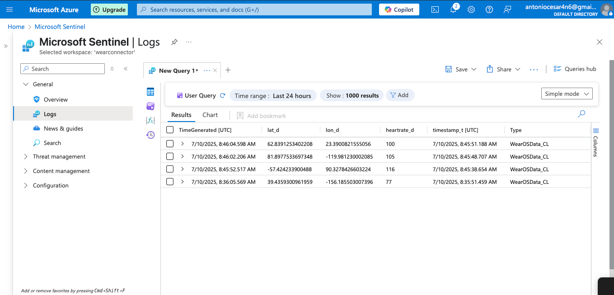
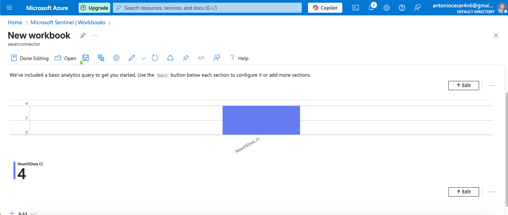
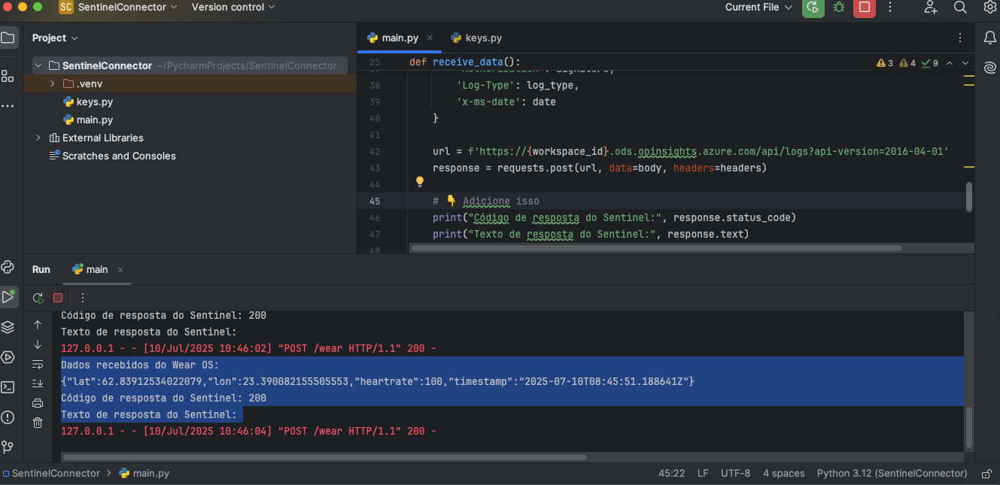
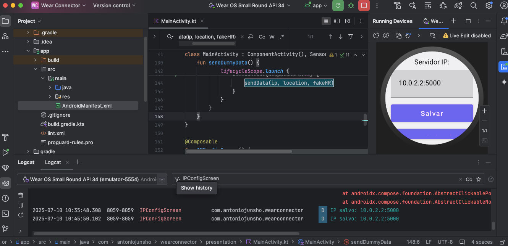

# SentinelConnector
Just a simple connector in python and Kotlin for Sentinel.

Welcome! 👋

This is a small connector project designed to send data from a **WearOS app** (built in Android Studio) to a **Python server** in flask, which forwards it to **Sentinel**.

---

## 📱 What does it works?

To make it work on your WearOS device (like a smartwatch), you must:

1. **Open the app** and set the **server IP address** (where the server is running).
2. Click on **Save** the IP will be stored for future use.
3. Optionally, **click the button below** to test send some **dummy data**.

The data being sent includes:

- `lat` – Latitude  
- `long` – Longitude  
- `heartrate` – Heart rate  
- `timestamp` – Timestamp

---

## 🔧 How to use

##Requirements

- A workspace and a sentinel should be already configure in Azure Cloud
- You should have your WorkspaceID and PrimaryID - found in Workspace > Agents > Log Analytics agent instructions
- Verify if your firewall or any other security rules is blocking access either via internal ip 10.0.2.2 (in android studio emulator) or via external Ips.

### WearOS App
- Clone or download this repo.
- Open the WearOS project in **Android Studio**.
- Build and install the APK on your WearOS device or emulator.
- Set the server IP using the GUI inside the app.
- Click the button to send test data (optional).

### Python Connector
- Make sure you have Python 3 installed.
- Run the Python server included in this repo.
- It will listen for incoming data from the WearOS app and forward it to Sentinel.

##KSL:

WearOSData_CL
| project TimeGenerated, heartrate_d
| sort by TimeGenerated asc

Some Pics

